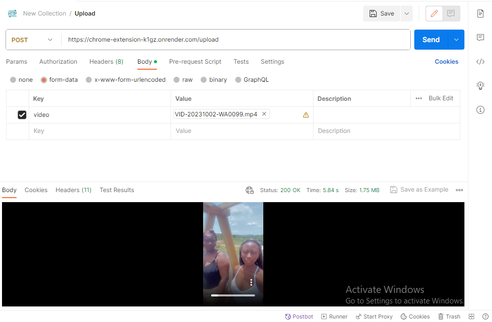
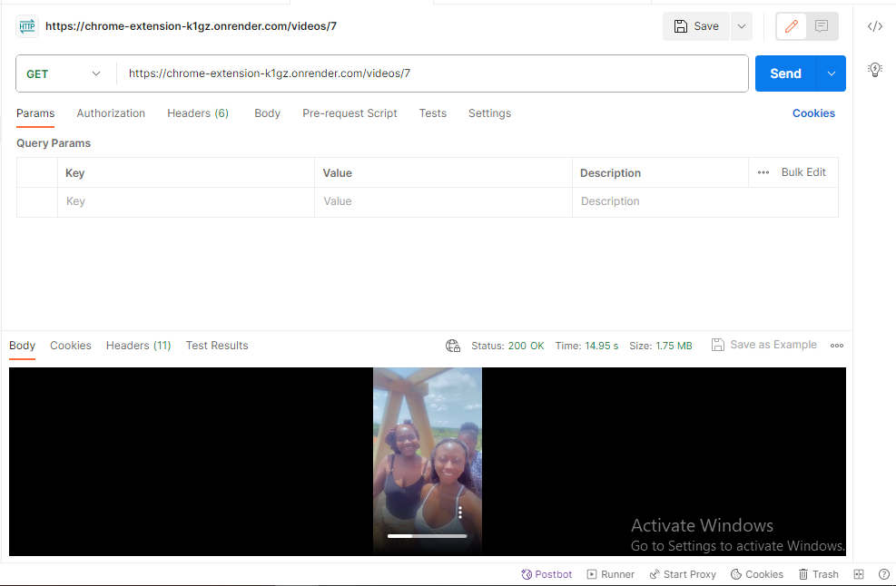

# chrome_extension_api
## Live Endpoint at https://chrome-extension-k1gz.onrender.com/

### Task:
Develop an API for a chrome screen recorder extension.
### Objective
 Build an API capable of storing a video from a chrome screen recorder extension, save it to the file system and render the page with the video for playing. the API should also be able to get a transcript of the video.
#### API Development
 Develop an API with endpoints for:
<ol>
<li>UPLOAD: Adding a video to the file system.</li>
<li>GET: Get the video from storage</li>
<li>TRANSCRIBE: Get the transcript of the video</li>
</ol>

## Project Setup
#### Clone the repository 
```
git clone https://github.com/sa-pphire/chrome_extension_api
```
#### Install all dependencies
```
npm install
```
## Run Project
```
node server.js
```

## API Testing
The following table shows overview of the APIs that will be exported:

- POST   `/upload`                post video to storage
- GET   `/videos/:id`             get video from storage
- GET    `transcript/:id`         get transcript of video


### Route tests

- Upload a new video using `POST https://chrome-extension-k1gz.onrender.com/upload` Api




- Retrieve a video by id using `GET https://chrome-extension-k1gz.onrender.com/videos/:id` Api



- Get transcript pf a video using `GET https://chrome-extension-k1gz.onrender.com/transcript/:id` Api


PS New uploaded videos would have an id of 9